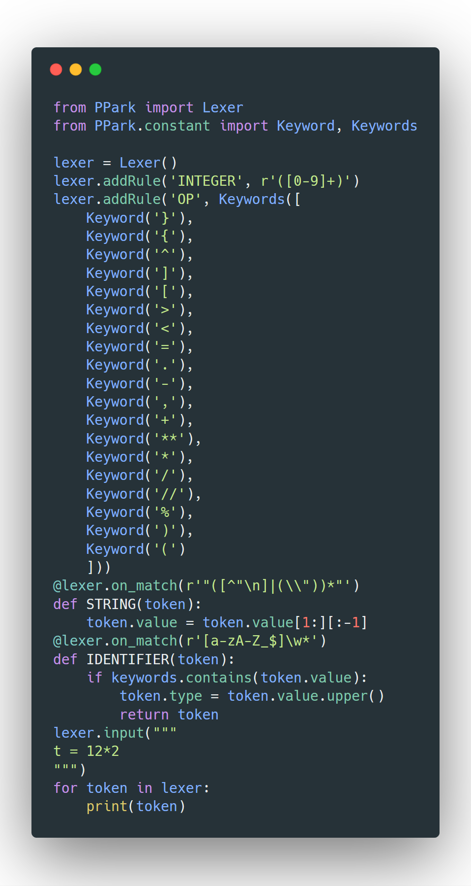

<h1 align="center">
  <br>
  <a href="https://github.com/aabbfive/PPark">
    
  </a>
  <br>
  PPark
  <br>
  <br>
</h1>

<h4 align="center">&#128204; The best lexing library available any python version confused (2.x, 3.x, PyPy...)</h4>

## &#x1F4BE; Install

Download the latest version of PPark from
the [GitHub releases](https://github.com/aabbfive/PPark/releases) page.


## &#x1F4AC; How to Contribute

### Get the code

```
$ git clone https://github.com/aabbfive/PPark.git
$ cd PPark
```

### Install the library

```
$ pip install PPark
```

#### Or

```
$ pip install git+https://github.com/aabbfive/PPark
```

## &#128451;&#65039; Sample


## &#x00A9;&#xFE0F; License

MIT. Copyright (c) [Aabbfive](https://github.com/aabbfive).
